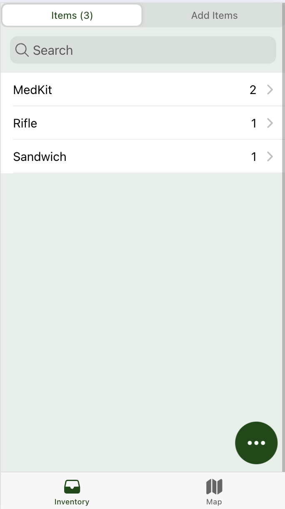
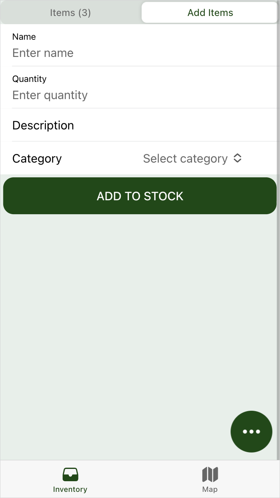
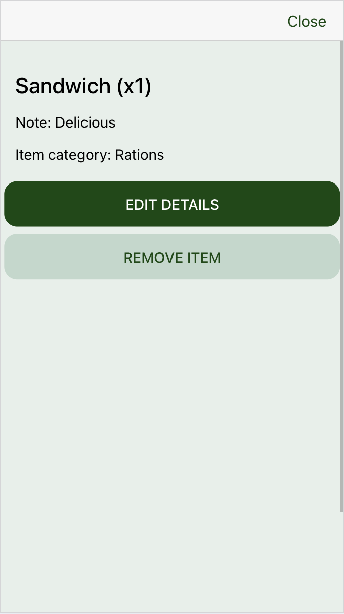
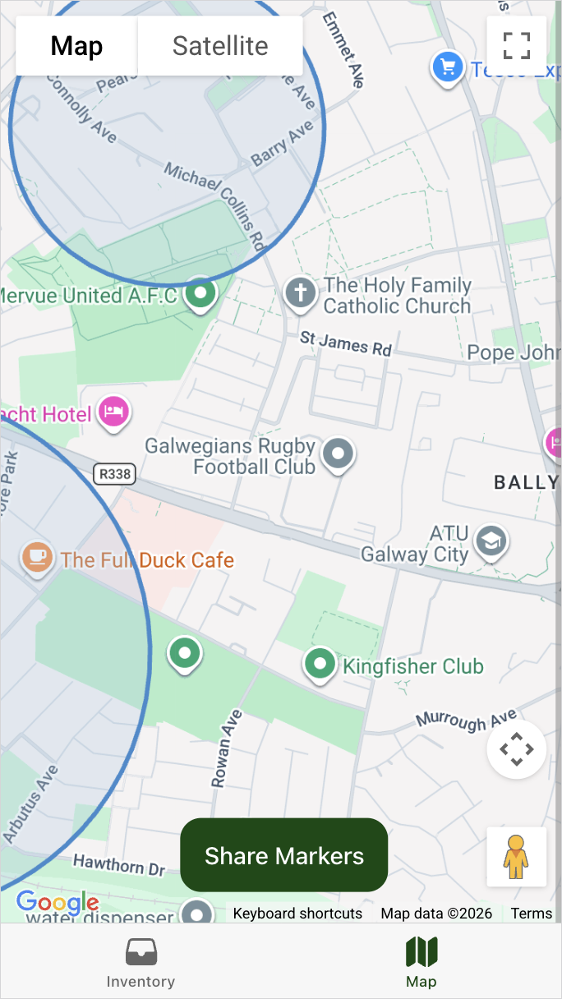
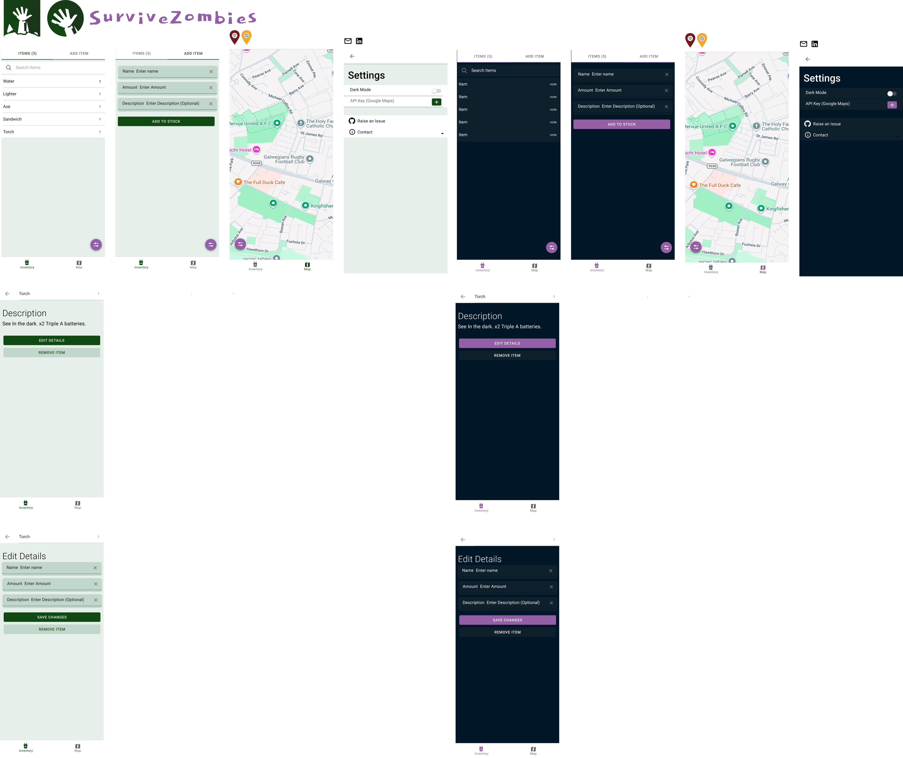

# SurviveZombies - Survival App for the Apocalypse

SurviveZombies is [PWA](https://en.wikipedia.org/wiki/Progressive_web_app) that helps survivors manage inventory and stay safe in safe-zones and share inventory and markers with other survivors

### Screenshots
| Inventory | Add Items | Listing | Map |
| :---: | :---: | :---: | :---: |
|  |  |  |  |

## Features

- **Inventory management** (add, edit, remove, search, categorize items)

- **Local persistence** using Ionic Storage

- **Map markers** for tracking benign/danger locations

- **Safe zones overlay** loaded from a [remote JSON feed](https://gist.github.com/helloShreyasJ/32a260f3cf0b5eaf1442c42fe981e849)

- **Share support** for inventory and marker coordinates

- **Settings page** for dark mode and Google Maps API key input

## Google Maps API Key

- The app uses the Google Maps API. Add your API key from in-app settings.

- Get your first key [here](https://console.cloud.google.com/google/maps-apis/credentials)

## Prerequisites

- **Node.js 22+** (Capacitor CLI in this repo targets Node 22+)

- npm

## Wireframe

## Tech Stack

- Ionic 8

- Angular 20 (standalone components)

- Capacitor

## How do I use it?

1. Clone the repository

   `git clone https://github.com/helloShreyasJ/SurviveZombies-Ionic.git`

2. Open the project in Visual Studio or Rider.

3. `npm install`

4. `ionic serve`
